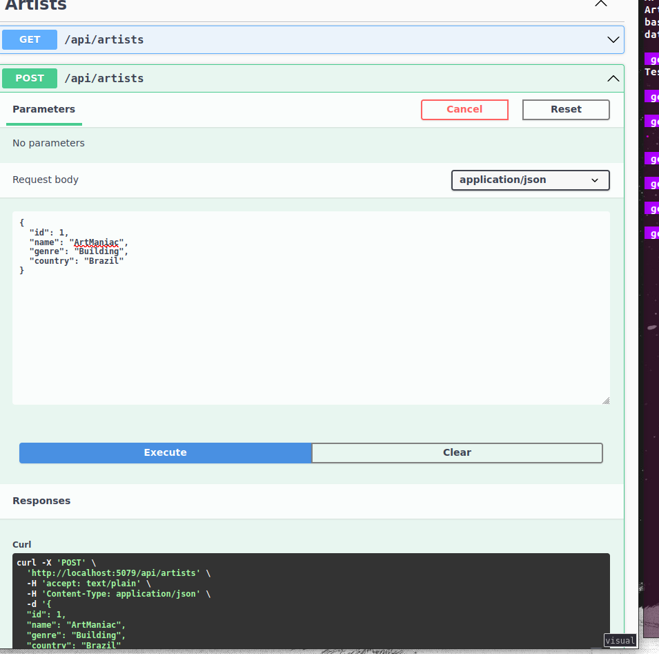
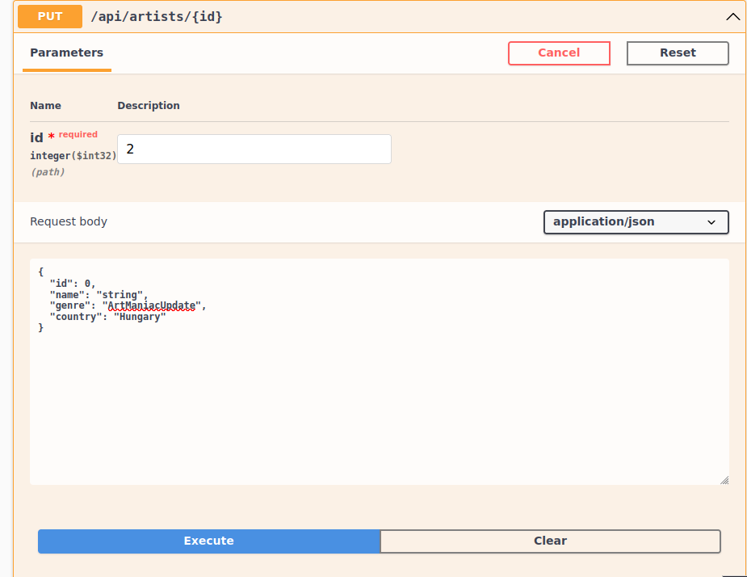
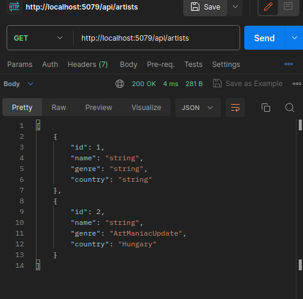

# Simple API Template for Testing HTTP and Routing

This repository contains a simple API template designed for testing HTTP requests and routing functionality. It provides a basic implementation of an API for managing artists, including endpoints for retrieving, creating, updating, and deleting artist information.

## Usage

To use this API template, follow the steps below:

1. Clone the repository to your local machine.
2. Open the project in your preferred development environment.
3. Build the project to restore the dependencies and compile the code.
4. Run the project to start the API server.

## API Endpoints

The API template exposes the following endpoints:

- **GET /api/artists**: Retrieves a list of all artists.
- **GET /api/artists/{id}**: Retrieves detailed information about a specific artist.
- **POST /api/artists**: Creates a new artist.
- **PUT /api/artists/{id}**: Updates an existing artist.
- **DELETE /api/artists/{id}**: Deletes an artist.

Refer to the code provided in the `ArtistsController.cs` file for more information about the implementation of each endpoint.

## Testing the API

You can test the API endpoints using the following methods:

### Postman

1. Install [Postman](https://www.postman.com/downloads/) if you haven't already.
2. Launch Postman and create a new request.
3. Set the request URL to the desired endpoint (e.g., `http://localhost:5000/api/artists`).
4. Choose the appropriate HTTP method for the request (GET, POST, PUT, DELETE).
5. Add any required request headers or body parameters.
6. Click the "Send" button to make the request and view the response.

### Swagger UI

1. Launch the API server and open a web browser.
2. Access the Swagger UI documentation by navigating to 
3. Explore the available endpoints listed in the Swagger UI interface.
4. Click on an endpoint to expand it and view details such as request and response examples.
5. Use the provided "Try it out" button to execute the endpoint and observe the response.

## Screenshots

Here are some screenshots demonstrating the CRUD operations:

*Screenshot: Creating a new artist.*

*Screenshot: Retrieving a list of artists.*

*Screenshot: Updating artist information.*

*Screenshot: Deleting an artist.*

## Data Storage

The API template uses an in-memory data storage approach implemented in the `DataContext.cs` file. For simplicity and demonstration purposes, the `DataContext` class stores the artist information in a `List<Artist>` object.

## Dependencies

This project relies on the following dependencies:

- Microsoft.AspNetCore.Mvc
- Microsoft.Extensions.DependencyInjection
- Microsoft.OpenApi.Models

Ensure that you have these dependencies installed and properly configured in your development environment.

